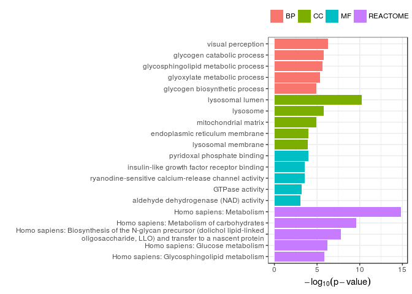

FunEnrich
================
Gregorio Alanis-Lobato

BP, CC, MF (i.e. Gene Ontology) and REACTOME enrichment analyses for a list of genes of interest, given a list of background genes.

The package supports ENTREZIDs (default), GENE SYMBOLs and UNIPROT accessions.

Installation
============

1.  Install the `devtools` package from CRAN if you haven't done so:

``` r
install.packages("devtools")
```

1.  Load the `devtools` package:

``` r
library("devtools")
```

1.  Install `FunEnrich` using the `install_github` function:

``` r
install_github("galanisl/FunEnrich")
```

Usage
=====

To start using `FunEnrich`, load the package:

``` r
library("FunEnrich")
```

Let's now use the gene-disease associations included in the package. We will use `disease.genes` as background and genes associated with `metabolic` disorders as genes of interest (type `?metabolic` and `?disease.genes` in R for more information about these datasets):

``` r
analysis <- fun_enrich(gene.list = metabolic, background = disease.genes, 
                       id.type = "ENTREZID", benjamini = FALSE)
```

We can now explore, for example, the Molecular Functions enriched in genes that are specifically associated with metabolic disorders...

``` r
head(analysis$mf)
```

    ##          go.id                                                 term
    ## 624 GO:0030170                          pyridoxal phosphate binding
    ## 323 GO:0005159          insulin-like growth factor receptor binding
    ## 340 GO:0005219 ryanodine-sensitive calcium-release channel activity
    ## 101 GO:0003924                                      GTPase activity
    ## 118 GO:0004029                aldehyde dehydrogenase (NAD) activity
    ## 246 GO:0004806                         triglyceride lipase activity
    ##             pval
    ## 624 0.0001081392
    ## 323 0.0002985053
    ## 340 0.0002985053
    ## 101 0.0006422754
    ## 118 0.0008238455
    ## 246 0.0008238455

... as well as the enriched REACTOME pathways:

``` r
head(analysis$reactome)
```

    ##           react.id
    ## 91   R-HSA-1430728
    ## 1034   R-HSA-71387
    ## 702   R-HSA-446193
    ## 1022   R-HSA-70326
    ## 180  R-HSA-1660662
    ## 704   R-HSA-446203
    ##                                                                                                                                  pathway
    ## 91                                                                                                              Homo sapiens: Metabolism
    ## 1034                                                                                           Homo sapiens: Metabolism of carbohydrates
    ## 702  Homo sapiens: Biosynthesis of the N-glycan precursor (dolichol lipid-linked oligosaccharide, LLO) and transfer to a nascent protein
    ## 1022                                                                                                    Homo sapiens: Glucose metabolism
    ## 180                                                                                           Homo sapiens: Glycosphingolipid metabolism
    ## 704                                                                                      Homo sapiens: Asparagine N-linked glycosylation
    ##              pval
    ## 91   1.401490e-15
    ## 1034 2.748917e-10
    ## 702  1.596449e-08
    ## 1022 5.894149e-07
    ## 180  1.425224e-06
    ## 704  1.744076e-06

It is also possible to generate a bar plot that focuses on the most enriched term of one or all categories:

``` r
plot_fun_enrich(enr = analysis, aspect = "ALL", benjamini = F, top = 5)
```


